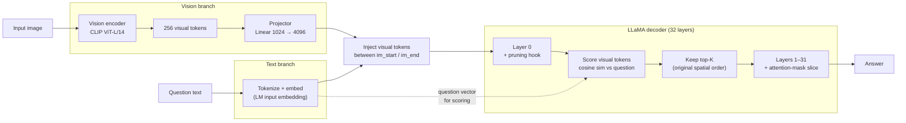

# Project Overview

## Title

Question-Aware Visual Token Pruning for Medical VLMs.

## People

| Role | Person |
| ---- | ------ |
| Researcher | Li-Wen Kuan (關力文) — Leo Kuan |
| Advisor    | Yuan-Kai Wang (王元凱) |
| Institution | Fu Jen Catholic University (輔仁天主教大學) |

## Motivation

Medical vision–language models like LLaVA-Med work by:

1. Passing an image through a vision encoder (typically a CLIP ViT)
   that produces a sequence of **visual tokens** — one per image patch
   plus a global token. For a standard 336×336 input with patch size
   14, that's 576 tokens.
2. Projecting those tokens into the language model's embedding space.
3. Prepending them to the user's text question and letting the LM
   generate an answer.

Most of those 576 tokens are not relevant to any given question. A
question like *"Is there a pneumothorax in the right lung?"* depends on
a small region of the image; the rest is noise that the model must
nonetheless attend over at full cost.

**The opportunity:** if we can identify which visual tokens matter
*for the specific question being asked* and drop the rest, we can:

- Reduce inference compute (fewer tokens through the LM).
- Potentially improve answer quality (less distractor signal).
- Make the model more interpretable (we can visualise which patches it
  kept).

## Research question

> Can a question-conditioned token-pruning mechanism preserve — or
> improve — medical VQA accuracy on standard benchmarks while
> meaningfully reducing inference cost on the LLaVA-Med baseline?

## Hypothesis

A lightweight scoring head, conditioned on the question embedding, can
rank visual tokens by relevance and prune the bottom K% with negligible
accuracy loss. We expect:

- **Lower bound:** at K = 25%, accuracy on VQA-RAD / SLAKE drops by
  less than 1 absolute point.
- **Upper bound:** at K = 50%, accuracy may drop by 2–4 points but
  latency drops more than proportionally because attention cost is
  quadratic in token count.
- **Sweet spot:** somewhere in between, ideally with a regime where
  accuracy *improves* on questions that target small image regions.

This is a hypothesis, not a result — the experiments will tell us
whether the shape of the trade-off actually looks like this.

## Related work (skim list — to read properly in Week 1–2)

| Paper | Authors | Venue | Institution(s) | Why it's relevant |
| ----- | ------- | ----- | -------------- | ----------------- |
| [LLaVA-Med: Training a Large Language-and-Vision Assistant for Biomedicine in One Day](https://proceedings.neurips.cc/paper_files/paper/2023/hash/5abcdf8ecdcacba028c6662789194572-Abstract-Datasets_and_Benchmarks.html) | Li, Wong, Zhang et al. | NeurIPS 2023 (Datasets & Benchmarks, Spotlight) | Microsoft Research | Our baseline — medical instruction-tuned VLM |
| [Token Merging: Your ViT But Faster (ToMe)](https://openreview.net/forum?id=JroZRaRw7Eu) | Bolya et al. | ICLR 2023 (notable top-5%) | Georgia Tech, Meta AI | Classic ViT-side token reduction; question-agnostic |
| [An Image is Worth 1/2 Tokens After Layer 2 (FastV)](https://www.ecva.net/papers/eccv_2024/papers_ECCV/papers/10478.pdf) | Chen et al. | ECCV 2024 (Oral, top-2%) | Peking University, Alibaba Group | Closest prior art — drops visual tokens inside the LM after early layers |
| [LLaVA-PruMerge: Adaptive Token Reduction for Efficient Large Multimodal Models](https://openaccess.thecvf.com/content/ICCV2025/html/Shang_LLaVA-PruMerge_Adaptive_Token_Reduction_for_Efficient_Large_Multimodal_Models_ICCV_2025_paper.html) | Shang et al. | ICCV 2025 | UCF, UW-Madison, USC, UIC | Adaptive token reduction conditioned on visual-encoder sparsity |
| [SparseVLM: Visual Token Sparsification for Efficient VLM Inference](https://openreview.net/forum?id=80faIPZ67S) | Y. Zhang et al. | ICML 2025 (poster) | Peking University, Fudan, UC Berkeley, Panasonic | **Text-aware** visual token pruning in general VLMs — closest in spirit to our "question-aware" angle |
| [Grounding-Aware Token Pruning (GAP)](https://arxiv.org/abs/2506.21873) | Chien et al. | arXiv 2025 (preprint) | National Tsing Hua University | Position-ID re-alignment fix after token drop — critical correction for RoPE-based VLMs |
| [MedPruner: Training-Free Hierarchical Token Pruning for Efficient 3D Medical Image Understanding in VLMs](https://arxiv.org/abs/2603.11625) | Liu et al. | arXiv 2026 (preprint) | CUHK, Westlake University (+ collaborators) | Closest medical-domain prior art; 3D-focused but uses attention-based selection in a Medical VLM |
| _Add as you read._ |  |  |  |  |

The key gap: most prior work prunes tokens **without** reference to the
question — they're question-agnostic. SparseVLM is the closest existing
work to question-awareness, but operates on general VLMs. Our angle is
making pruning question-aware *in the medical domain*, where the
question encodes strong spatial priors (anatomy + finding type).

## Approach (sketch)

The pruning logic is the new component; everything else is reused
from LLaVA-Med v1.0. Each component, briefly:

- **Vision encoder + projector** are unmodified. CLIP-ViT-L/14 at
  224×224 produces 256 visual tokens at the projector output, each in
  the LLM's 4096-dim embedding space.
- **Pruning runs inside the LLM, at the input to layer 0.** This is a
  reversal of an earlier design choice — pre-projector pruning was
  attempted first but is incompatible with LLaVA-Med v1.0's forward
  pass, which validates that the number of visual feature vectors
  matches the count of `<im_patch>` placeholder tokens in the prompt.
  Pruning *after* the visual tokens are injected into the LLM's input
  sequence sidesteps the validation. This is the same insertion point
  FastV uses.
- **Scoring is cosine similarity against the pooled question
  embedding.** The question text gets tokenized and embedded through
  the LLM's input embedding layer (the only space where it's directly
  comparable to projected visual tokens), then mean-pooled to a single
  4096-dim vector. Each visual token is scored against that vector via
  cosine similarity; the top-K are kept in their original spatial
  order.
- **Hook architecture spans all 32 LLaMA decoder layers.** Layer 0's
  pre-forward hook performs the scoring, the selection, and slicing
  of `hidden_states` and `attention_mask`. Layers 1-31 each have a
  pre-forward hook that re-slices `attention_mask` to match the pruned
  sequence length the cache now holds. A monkey-patched
  `prepare_inputs_for_generation` keeps the externally-maintained
  decode-step `attention_mask` consistent with the pruned KV cache.
  All of this is hook-based and training-free — no model surgery.
- **Random pruning is the comparison floor.** Same hooks, same hyper-
  parameters, same machinery; indices drawn from a seeded
  `torch.Generator` instead of question similarity. The ablation
  isolates the contribution of question-awareness specifically.

**First result (May 17, kr=0.75 on VQA-RAD):** question-aware pruning
beats the unpruned stage-2 baseline by +2.6 pts closed accuracy
(60.29 vs 57.72) while removing 25% of visual tokens; random pruning
at the same ratio is within noise of baseline (56.99). One ratio is
one datapoint — the full Pareto curve (kr ∈ 0.50, 0.25, 0.10) is
what tests whether the +3.3 pt qsim-over-random gap holds, grows, or
disappears. Full writeup:
[Week 2, Day 1](weekly/week-02/day-01.md#phase-14-kr075-ablation-result-question-aware-pruning-beats-baseline).

**Known limitations of the current approach**, flagged up front:

- **Position-ID re-indexing** — when visual tokens are dropped, the
  remaining tokens get re-indexed contiguously. This is the
  FastV-style convention and is accepted in the literature, but it's
  worth noting that GAP-style positional preservation is an
  alternative we haven't tested.
- **Latency overhead at low pruning ratios.** Hook fixed-cost
  (32 layer hooks + the `prepare_inputs_for_generation` patch + the
  scoring computation) currently dominates the compute saved by
  dropping 64 of 256 tokens. Speedup is expected to emerge at
  kr ≤ 0.5 where the visual-token reduction is more substantial.
- **VQA-RAD only so far.** SLAKE and PathVQA repeats follow once the
  VQA-RAD Pareto curve is filled in.

Open design choices not yet explored (will be Phase 4+):

- **Alternative scoring functions** — cross-attention rather than
  cosine similarity, FastV-style layer-K attention scoring, or a
  small learned MLP.
- **Pruning at a later LLaMA layer** — FastV finds that pruning after
  layer 2-3 often outperforms pruning at layer 0 because early layers
  contribute to the question representation that scoring depends on.
- **Per-question keep-ratio** — easy questions don't need many tokens;
  hard ones do. An adaptive kr could improve the Pareto curve.

## 12-week plan

| Phase | Weeks | Focus | Deliverable |
| :---: | ----- | ----- | ----------- |
| 1 | 1–2  | Baseline & literature | Reproduced LLaVA-Med, lit-review notes, profiling numbers |
| 2 | 3–4  | Codebase deep-dive    | Diagram of LLaVA-Med's forward pass, identified pruning insertion points |
| 3 | 5–6  | Scoring-head v1       | First trainable pruning module, sanity-check results |
| 4 | 7–8  | Training & ablations  | K-sweep, head-architecture ablations |
| 5 | 9–10 | Full evaluation       | VQA-RAD / SLAKE numbers, latency benchmarks |
| 6 | 11   | Write-up              | Draft report, figures |
| 7 | 12   | Final report & demo   | Polished report, code release |

These dates will shift; the [Weekly Log](weekly/index.md) tracks what
actually happens.

## Success criteria

The project is a success if **any** of the following are true:

1. We achieve ≥40% token reduction with <1pt accuracy drop on VQA-RAD
   and SLAKE.
2. We find a question-type regime where pruning *improves* accuracy.
3. We produce a clean, reusable pruning module that other researchers
   can plug into LLaVA-Med or similar VLMs.

The project is **not** a failure if pruning doesn't help — a careful
negative result with proper ablations is also a useful contribution.
