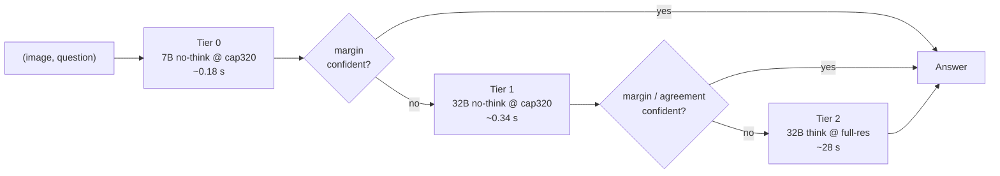

# Project Overview

## Title

Training-Free Model Cascades for Compute-Efficient Medical VLMs.

!!! note "A note on the title"
    The project was launched as *"Question-Aware Visual Token Pruning for
    Medical VLMs"* and the GitHub repository keeps that name. Through the
    pivots documented below, the work is now a **training-free model cascade**
    for medical VQA. The original pruning direction is preserved as
    [research history](#the-research-journey-how-we-got-here).

## People

| Role | Person |
| ---- | ------ |
| Researcher | Li-Wen Kuan (關力文) — Leo Kuan |
| Advisor    | Yuan-Kai Wang (王元凱) |
| Institution | Fu Jen Catholic University (輔仁天主教大學) |

## Motivation

Medical VQA is increasingly solved by **large reasoning VLMs** — models that
emit a long chain-of-thought before answering. They are accurate, but a single
answer can cost hundreds of decode tokens on a 32B model: slow, energy-hungry,
and hard to deploy at scale in a clinical setting.

Yet most medical-VQA questions are *not* hard. A 7B model already answers a
large share of them correctly; only a minority genuinely need the big model's
capacity. This is exactly the setting a **cascade** is built for:

1. Run a **cheap model** (7B) on every question.
2. Use a lightweight **gate** to decide, per question, whether the cheap answer
   can be trusted.
3. **Escalate only the uncertain questions** to the **expensive model** (32B).

If the gate is good and most questions stay on the cheap leg, the cascade
approaches the big model's accuracy at a fraction of its cost — and because
nothing is trained, it drops onto any existing model pair.

## Research question

> Can a **training-free** cascade match a 32B medical VLM's accuracy on
> standard medical-VQA benchmarks while **substantially reducing inference
> cost** — measured honestly in prefill-inclusive FLOPs, wall-clock latency,
> and energy?

## The method

The deployable system is a **7B→32B confidence-margin cascade** on the
[MedVLThinker](baseline/medvlthinker.md) model family, refined over Weeks 5–6
into the **Adaptive-Compute Cascade (ACC)**.

**The gate.** The cheap model's **confidence margin** — the gap between its top
two answer-option probabilities — is the escalation signal. A single frozen
threshold, fit once on a held-out split, decides escalation. A reviewer-grade
audit showed this one-line gate is *near-optimal*: no learned, conformal, or
self-verification gate beats it, because whether the 32B will *rescue* a given
7B error is near-unpredictable (≈0.6 AUROC) from any cheap signal. The gate
axis is therefore **closed** — an honest negative result that rules out a large
family of "smarter router" proposals.

**The structural lever (ACC).** The real compute lever turned out to be the
*strong leg's reasoning mode*. The 32B's chain-of-thought **over-thinks
perception VQA** — on the competent benchmarks, 32B-*no-think* beats 32B-think
(e.g. +7.7 on SLAKE, +11.7 on VQA-RAD) at ~2 decode tokens instead of ~477. So
ACC promotes the 32B's *fast* mode to an intermediate tier:

Three tiers built from only **two checkpoints**, each gated by its own margin;
slow reasoning fires only on the residual that genuinely needs it. **ACC-v2**
adds the one cascade-native gate that survives scrutiny: because both models
have already run by Tier 1, their **disagreement** is a free query-by-committee
signal — escalate to the think tier only when 7B and 32B disagree.

**The result.** Against an always-32B-think baseline at matched accuracy, ACC
cuts **latency by 72%, energy by 75%, and FLOPs by roughly half** on the full
six-benchmark pool (far more on the perception-only pools), and is strictly
**guardrail-clean**. The accounting is the contribution's backbone: FLOPs are
exact and prefill-inclusive; latency and energy are calibrated against real
batch-1 NVML measurements (R² = 0.99).

## Related work

The work sits in the **LLM/VLM cascade-and-routing** literature. A cascade is a
*post-generation* method (decide after the cheap model answers), distinct from
a *router* (decide before generating). The standard evaluation unit is a swept
**cost–quality curve** summarized by AIQ / nAUC; the project's "match quality
at lower cost" result corresponds to the established metric **Quality-Neutral
Cost (QNC)**.

| Paper | Venue | Why it's relevant |
| ----- | ----- | ----------------- |
| [FrugalGPT](https://arxiv.org/abs/2305.05176) | 2023 | The canonical LLM cascade — cheap→expensive with a learned scorer; our margin gate is the training-free analog |
| [AutoMix](https://arxiv.org/abs/2310.12963) | 2023 | Self-verifying cascade routing — the closest analog to ACC's self-gating |
| [Cascade Routing](https://arxiv.org/abs/2410.10347) | 2024 | The strongest general cascade-routing baseline to compare against |
| [RouteLLM](https://arxiv.org/abs/2406.18665) | 2024 | Learned routing with preference data; the transfer-framing reference |
| [RouterBench](https://arxiv.org/abs/2403.12031) | 2024 | Standard routing benchmark + the AIQ/nAUC evaluation convention |
| [CP-Router](https://arxiv.org/abs/2505.19970) | 2025 | Conformal routing (Full-and-Binary-Entropy) — our nearest neighbor on the signal side, used as a contrast baseline |
| [LLMRouterBench](https://arxiv.org/abs/2601.07206) | 2026 | Independently corroborates "simple baselines beat complex learned routers" — our exact internal finding |
| [Routing survey](https://arxiv.org/abs/2603.04445) | 2026 | The taxonomy this work is positioned within; flags the no-think-intermediate-tier intersection as an open gap |

The **gap** this project occupies: *training-free × cascade × medical VLM ×
prefill-inclusive honest accounting* is an unoccupied intersection — no
published training-free cascade for medical VLMs exists. VLM-specific neighbors
(AVR, SGL, VL-RouterBench) and confidence-deferral theory (Narasimhan 2022,
Jitkrittum 2023, Geifman & El-Yaniv 2017) are tracked in
[Resources](resources.md).

??? note "Legacy related work — the visual-token-pruning era"
    The project's first three weeks targeted **question-aware visual token
    pruning**, with a related-work set centered on ToMe, FastV, SparseVLM,
    PruMerge, GridPrune, GAP, and MedPruner. That literature, and the
    medical-VQA-properties survey behind it, is preserved in the
    [Week 3 logs](weekly/week-03/index.md) and
    [Resources](resources.md#legacy-visual-token-pruning). The token-pruning
    literature reconnects to the current work as the *orthogonal* "make each
    leg cheaper" axis that composes with a cascade.

## The research journey (how we got here)

The cascade direction was reached by **eliminating** alternatives — a chain of
evidence-backed negative results. Each phase is documented in full in the
[Weekly Log](weekly/index.md); the spine:

1. **Visual-token pruning (Weeks 1–3).** Question-aware pruning across three
   base models ([LLaVA-Med](baseline/llava-med.md) →
   [Qwen2.5-VL](baseline/qwen25-vl.md) →
   [HuatuoGPT-Vision](baseline/huatuo-vision.md)). **Closed:** random selection
   Pareto-dominates every structured method at every keep-ratio. The reason —
   the model barely needs fine-grained visual evidence — is a grounding
   finding.
2. **Visual grounding / adaptive compute (Week 4).** Evidence-sensitivity
   routing and an image-difficulty compute wedge. **Closed:** no internal
   signal orthogonal to confidence; the image-difficulty signal was weak and
   wrong-signed.
3. **Single-model routing (Week 5).** 4-policy routing on one
   [MedVLThinker-7B](baseline/medvlthinker.md). **Closed:** the arms of one
   model share knowledge and blind spots — the oracle falls far below the
   independence floor (z = −25 to −29σ).
4. **Cross-model cascade (Week 5).** 7B→32B confidence-margin cascade.
   **Committed:** real complementarity (+12.5pp oracle); matches 32B at 0.639×
   compute; accuracy headroom unreachable from cheap signals.
5. **ACC (Week 6).** The strong-leg compute mode → a 3-tier cascade + a free
   agreement gate. **Current.**

## 12-week plan

The original plan targeted a trainable pruning head; the actual trajectory
pivoted to cascading. Status reflects what happened.

| Phase | Weeks | Focus | Status |
| :---: | ----- | ----- | ------ |
| 1 | 1–2  | Baseline & literature (LLaVA-Med → Qwen2.5-VL) | Done |
| 2 | 3    | HuatuoGPT-Vision baseline; pruning sweeps | Done — pruning closed |
| 3 | 4    | Visual grounding / adaptive-compute exploration | Done — closed |
| 4 | 5    | Pivot to the 7B→32B cascade; reviewer-grade audit; CVGIP submission | Done |
| 5 | 6    | ACC — the structural result; literature positioning | In progress |
| 6 | 7–10 | Harden ACC: mixed-set calibration, runnable baselines (AutoMix, Cascade Routing), higher-tier write-up | Planned |
| 7 | 11–12 | Final report, figures, code release | Planned |

The [Weekly Log](weekly/index.md) tracks what actually happens.

## Success criteria

The project is a success if **any** of the following hold:

1. A training-free cascade matches a 32B medical VLM's accuracy at a clear,
   honestly-measured compute saving on the competent medical-VQA benchmarks.
   *(Met: the margin cascade at 0.639× compute; ACC at −72% latency / −75%
   energy.)*
2. The negative result on the gate axis is airtight and broad enough that its
   *generality* is a contribution.
3. A clean, reusable, training-free cascade + measurement harness that other
   researchers can drop onto a different model pair.

A careful **negative result** with proper ablations is itself a useful
contribution — and several of this project's load-bearing findings are exactly
that.
