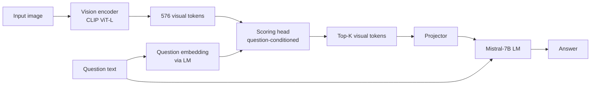

# Project Overview

## Title

**Question-Aware Visual Token Pruning for Medical VLMs.**

## People

| Role | Person |
| ---- | ------ |
| Researcher | Li-Wen Kuan (關力文) — Leo Kuan |
| Advisor    | Yuan-Kai Wang (王元凱) |
| Institution | Fu Jen Catholic University (輔仁天主教大學) |

## Motivation

Medical vision–language models like LLaVA-Med work by:

1. Passing an image through a vision encoder (typically a CLIP ViT)
   that produces a sequence of **visual tokens** — one per image patch
   plus a global token. For a standard 336×336 input with patch size
   14, that's 576 tokens.
2. Projecting those tokens into the language model's embedding space.
3. Prepending them to the user's text question and letting the LM
   generate an answer.

Most of those 576 tokens are not relevant to any given question. A
question like *"Is there a pneumothorax in the right lung?"* depends on
a small region of the image; the rest is noise that the model must
nonetheless attend over at full cost.

**The opportunity:** if we can identify which visual tokens matter
*for the specific question being asked* and drop the rest, we can:

- Reduce inference compute (fewer tokens through the LM).
- Potentially improve answer quality (less distractor signal).
- Make the model more interpretable (we can visualise which patches it
  kept).

## Research question

> Can a question-conditioned token-pruning mechanism preserve — or
> improve — medical VQA accuracy on standard benchmarks while
> meaningfully reducing inference cost on the LLaVA-Med baseline?

## Hypothesis

A lightweight scoring head, conditioned on the question embedding, can
rank visual tokens by relevance and prune the bottom K% with negligible
accuracy loss. We expect:

- **Lower bound:** at K = 25%, accuracy on VQA-RAD / SLAKE drops by
  less than 1 absolute point.
- **Upper bound:** at K = 50%, accuracy may drop by 2–4 points but
  latency drops more than proportionally because attention cost is
  quadratic in token count.
- **Sweet spot:** somewhere in between, ideally with a regime where
  accuracy *improves* on questions that target small image regions.

This is a hypothesis, not a result — the experiments will tell us
whether the shape of the trade-off actually looks like this.

## Related work (skim list — to read properly in Week 1–2)

| Work | What it does | Why it's relevant |
| ---- | ------------ | ----------------- |
| LLaVA-Med (Li et al., 2023) | Medical instruction-tuned VLM | Our baseline |
| ToMe (Bolya et al., ICLR 2023) | Token merging in ViTs | Pruning at the vision encoder level |
| FastV (Chen et al., ECCV 2024) | Drops visual tokens inside the LM after early layers | Closest prior art for question-agnostic VLM pruning |
| PruMerge (Shang et al., 2024) | Adaptive visual token reduction | Another VLM-side pruning approach |
| SparseVLM (2024) | Text-aware visual token pruning | Question-aware angle in general VLMs |
| GAP — Grounding-Aware Pruning | Position-ID fix after token drop | Critical correction for RoPE models |
| _Add as you read._ |  |  |

The key gap: most prior work prunes tokens **without** reference to the
question — they're question-agnostic. Our angle is making pruning
question-aware *in the medical domain*, where the question encodes
strong spatial priors (anatomy + finding type).

## Approach (sketch)

The scoring head is the new component. Everything else is reused from
LLaVA-Med. Open design choices to explore:

- Where to put the scoring head — at the vision encoder output, or
  inside the LM after a few layers (FastV-style).
- How to condition on the question — cross-attention, dot-product
  scoring, or a small MLP.
- How to train it — start from a frozen LLaVA-Med, fine-tune with a
  task loss, optionally distill from the unpruned model.

## 12-week plan

| Phase | Weeks | Focus | Deliverable |
| :---: | ----- | ----- | ----------- |
| 1 | 1–2  | Baseline & literature | Reproduced LLaVA-Med, lit-review notes, profiling numbers |
| 2 | 3–4  | Codebase deep-dive    | Diagram of LLaVA-Med's forward pass, identified pruning insertion points |
| 3 | 5–6  | Scoring-head v1       | First trainable pruning module, sanity-check results |
| 4 | 7–8  | Training & ablations  | K-sweep, head-architecture ablations |
| 5 | 9–10 | Full evaluation       | VQA-RAD / SLAKE numbers, latency benchmarks |
| 6 | 11   | Write-up              | Draft report, figures |
| 7 | 12   | Final report & demo   | Polished report, code release |

These dates will shift; the [Weekly Log](weekly/index.md) tracks what
actually happens.

## Success criteria

The project is a success if **any** of the following are true:

1. We achieve ≥40% token reduction with <1pt accuracy drop on VQA-RAD
   and SLAKE.
2. We find a question-type regime where pruning *improves* accuracy.
3. We produce a clean, reusable pruning module that other researchers
   can plug into LLaVA-Med or similar VLMs.

The project is **not** a failure if pruning doesn't help — a careful
negative result with proper ablations is also a useful contribution.
